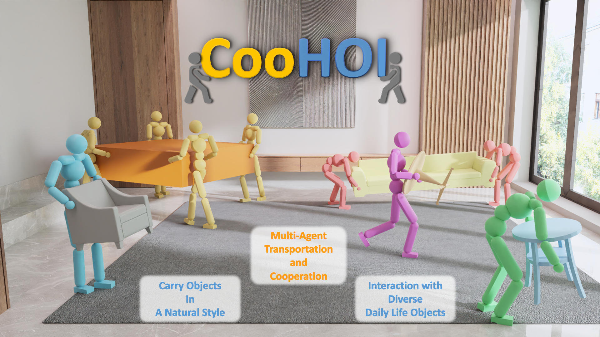

# CooHOI: Learning Cooperative Human-Object Interaction with Manipulated Object Dynamics

<div align="center">

[[Website]](https://gao-jiawei.com/Research/CooHOI/)
[[Arxiv]](https://arxiv.org/abs/2406.14558)

</div>


<div style="text-align: center;">
    
</div>

Official Implementation of the paper "CooHOI: Learning Cooperative Human-Object Interaction with Manipulated Object Dynamics".

We will release the code no later than end of October, 2024.

## News

- 09/25/2024: :tada: CooHOI is accepted as NeurIPS 2024 **spotlight**. Thanks for the recognition!

## BibTex

```bibtex
@article{gao2024coohoi,
  title={CooHOI: Learning Cooperative Human-Object Interaction with Manipulated Object Dynamics},
  author={Gao, Jiawei and Wang, Ziqin and Xiao, Zeqi and Wang, Jingbo and Wang, Tai and Cao, Jinkun and Hu, Xiaolin and Liu, Si and Dai, Jifeng and Pang, Jiangmiao},
  journal={arXiv preprint arXiv:2406.14558},
  url={https://arxiv.org/abs/2406.14558},
  year={2024}
}
```
