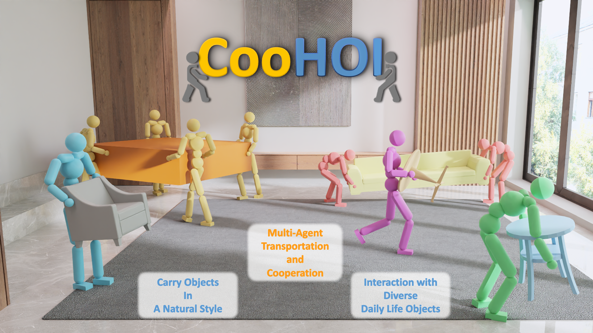

# CooHOI: Learning Cooperative Human-Object Interaction with Manipulated Object Dynamics

<div align="center">

[[Website]](https://gao-jiawei.com/Research/CooHOI/)
[[Arxiv]](https://arxiv.org/abs/2406.14558)

</div>


<div style="text-align: center;">
    
</div>

Official Implementation of the paper "CooHOI: Learning Cooperative Human-Object Interaction with Manipulated Object Dynamics".


## News

- 09/25/2024: :tada: CooHOI is accepted as NeurIPS 2024 **spotlight**. Thanks for the recognition!
- 12/12/2024: :sparkles: Presented CooHOI at NeurIPS 2024, Vancouver. Check out our [poster](https://x.com/WinstonGu_/status/1866967711877636310).
- 12/19/2024: :tada: Code open-sourced!


## Installation

Download Isaac Gym from [website](https://developer.nvidia.com/isaac-gym), or using CLI commands:

```bash
wget https://developer.nvidia.com/isaac-gym-preview-4
tar -xvzf isaac-gym-preview-4
```

Create conda environment:

```bash
conda create -n coohoi python=3.8
conda activate coohoi
```

Install IsaacGym wrappers for Python:

```bash
pip install -e isaacgym/python
```

Install other dependencies:

```bash
pip install -r requirements.txt
```
If encountering following error: `ImportError: libpython3.8m.so.1.0: cannot open shared object file: No such file or directory`, you need set the environment variables:

```bash
export LD_LIBRARY_PATH=/path/to/conda/envs/your_env/lib
```

## Commands

### Reproduce Results for our Paper

To see our results on single agent object carrying tasks:

```bash
CUDA_VISIBLE_DEVICES=0 python coohoi/run.py --test \
--task HumanoidAMPCarryObject \
--num_envs 1 \
--cfg_env coohoi/data/cfg/humanoid_carrybox.yaml \
--cfg_train coohoi/data/cfg/train/amp_humanoid_task.yaml \
--motion_file coohoi/data/motions/coohoi_data/coohoi_data.yaml \
--checkpoint coohoi/data/models/SingleAgent.pth
```

To see our results on 2 agent object carrying tasks:

```bash
CUDA_VISIBLE_DEVICES=0 python coohoi/run.py --test \
--task ShareHumanoidCarryObject \
--num_envs 4 \
--cfg_env coohoi/data/cfg/share_humanoid_carrybox.yaml \
--cfg_train coohoi/data/cfg/train/share_humanoid_task_coohoi.yaml \
--motion_file coohoi/data/motions/coohoi_data/coohoi_data.yaml \
--checkpoint coohoi/data/models/TwoAgent.pth
```

### Single Humanoid SKill Training

Training Commands:

```bash
CUDA_VISIBLE_DEVICES=0 python coohoi/run.py \
--task HumanoidAMPCarryObject \
--cfg_env coohoi/data/cfg/humanoid_carrybox.yaml \
--cfg_train coohoi/data/cfg/train/amp_humanoid_task.yaml \
--motion_file coohoi/data/motions/coohoi_data/coohoi_data.yaml \
--headless \
--wandb_name "<experiement_name>"
```

You will find your checkpoints in `output/Humanoid_<date>_<time>/nn` dir, to eval:

```bash
CUDA_VISIBLE_DEVICES=0 python coohoi/run.py --test \
--task HumanoidAMPCarryObject \
--num_envs 16 \
--cfg_env coohoi/data/cfg/humanoid_carrybox.yaml \
--cfg_train coohoi/data/cfg/train/amp_humanoid_task.yaml \
--motion_file coohoi/data/motions/coohoi_data/coohoi_data.yaml \
--checkpoint <checkpoint_path>
```

e.g.

```bash
CUDA_VISIBLE_DEVICES=0 python coohoi/run.py --test \
--task HumanoidAMPCarryObject \
--num_envs 16 \
--cfg_env coohoi/data/cfg/humanoid_carrybox.yaml \
--cfg_train coohoi/data/cfg/train/amp_humanoid_task.yaml \
--motion_file coohoi/data/motions/coohoi_data/coohoi_data.yaml \
--checkpoint output/Humanoid_19-16-52-17/nn/Humanoid.pth
```

### Two Humanoids Cooperation Training

By default, the two humanoids cooperation training starts from finetuning single humanoid policy. We load the single agent policy checkpoint in `--checkpoint <ckpt_path>`, and you can change this to your own checkpoint.

Cooperation Training:

```bash
CUDA_VISIBLE_DEVICES=0 python coohoi/run.py \
--task ShareHumanoidCarryObject \
--cfg_env coohoi/data/cfg/share_humanoid_carrybox.yaml \
--cfg_train coohoi/data/cfg/train/share_humanoid_task_coohoi.yaml \
--motion_file coohoi/data/motions/coohoi_data/coohoi_data.yaml \
--headless \
--checkpoint <ckpt_path> \
--wandb_name "<experiement_name>"
```

Evaluation:

```bash
CUDA_VISIBLE_DEVICES=0 python coohoi/run.py --test \
--task ShareHumanoidCarryObject \
--num_envs 4 \
--cfg_env coohoi/data/cfg/share_humanoid_carrybox.yaml \
--cfg_train coohoi/data/cfg/train/share_humanoid_task_coohoi.yaml \
--motion_file coohoi/data/motions/coohoi_data/coohoi_data.yaml \
--checkpoint <ckpt_path>
```

## Acknowledgement

- Our initial code is based on the [ASE Project](https://github.com/nv-tlabs/ASE).
- Our motion dataset comes from the [AMASS Dataset](https://amass.is.tue.mpg.de/).
- Our object dataset comes form the [SAMP Dataset](https://samp.is.tue.mpg.de/).


## Citation

If you use our code in your work, please consider citing our work:

```bibtex
@inproceedings{gao2024coohoi,
 author = {Gao, Jiawei and Wang, Ziqin and Xiao, Zeqi and Wang, Jingbo and Wang, Tai and Cao, Jinkun and Hu, Xiaolin and Liu, Si and Dai, Jifeng and Pang, Jiangmiao},
 booktitle = {Advances in Neural Information Processing Systems},
 title = {CooHOI: Learning Cooperative Human-Object Interaction with Manipulated Object Dynamics},
 year = {2024}
}
```